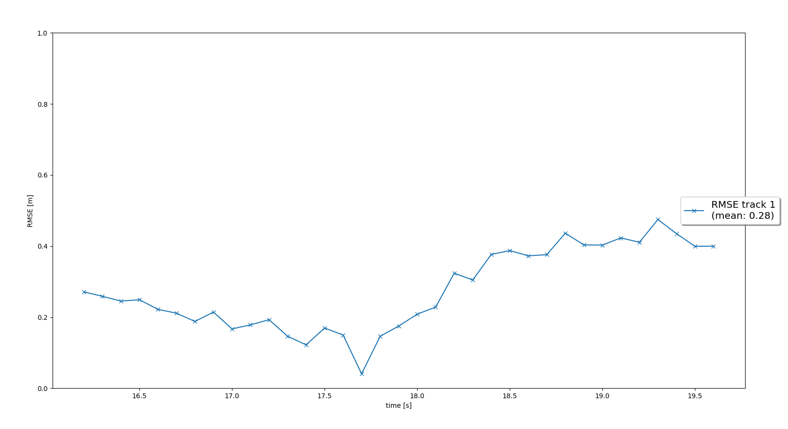
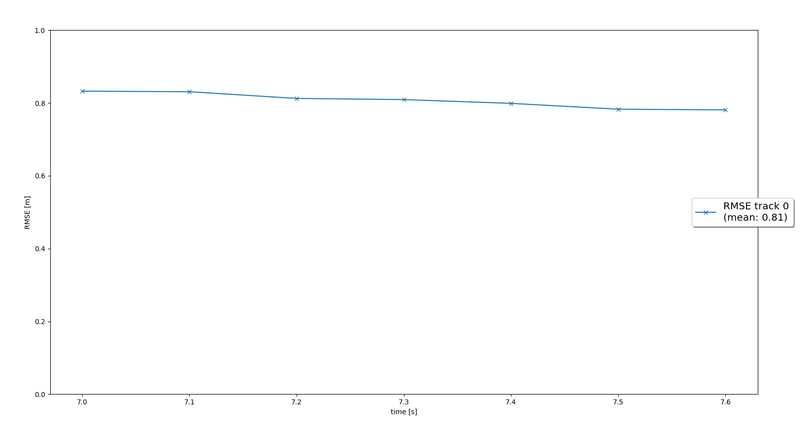

# SDCND : Sensor Fusion and Tracking

In this project, we fuse measurements from LiDAR and camera and track multiple vehicles over time. We will be using real-world data from the Waymo Open Dataset, load precomputed detection result and apply an extended Kalman filter for sensor fusion and tracking.

## Overview

This writeup documents the major workflow of implementing this project, including

* Tracking, implement a kalman filter to track a single object
* Track management, initialize, update and delete tracks to manage tracking for multiple objects
* Data association,  associate multiple measurements to multiple tracks
* Camera sensor fusion, on the basis of above operation, we add camera measurement fusion
* Evaluate, evaluate tracking result against groud truth
* Reflection

## Tracking
We use ekf to track objects. Tracking is implemented in `filter.py`.  
For the efk we implmented, the system state is [x,y,z,vx,vy,vz], process model is constant velocity model. process noise Q increase with time dt. For the road segment specified in classroom, the rmse score is 0.28.  

## Track Management

Track management is implemented in `trackmanagement.py`.  
In our system design, One object is represented as a track, and a track list is used to manage multiple objects.  To perform predict and udpate operatin on a track, we pass the track object and measurment info to ekf.

Below are the key points of track management:

* Track is initialized after receiving an unassigned lidar measurement.
* A track contains scores. Its score will be increased if it's associated a measurement, and decreased if it's not.
* A track contains state, which will be updated based on its score.
* A track will be deleted if its score is below a certain treshold and its state convariance is big.

On the road segment specified in classroom, we can see a vehicle appear and then disapper, according, we can see the track is initialized, confirmed, and then deleted.

## Data Association

At this stages, multiple measurements are properly matched to multiple tracks via nearest nearest neighbor association. Data association is implemented in `association.py`.  

Below are the key steps invovled in data association,

1) Create a mtraix for all available tracks and obervations.
2) Calculate Mahalanobis distance (MH) for each track measurement pairs.
3) Use Chi Square hypotheisis test to reject unlikely track measurement pairs.
4) Pick out the pair with smallest MHD, perform ekf update step, and remove corresponding row and column in the association matrix.
5) Go back to step 4 until all valid pairs are processed.

## Camera Sensor Fusion
## Tracking
## Evaluation
## Reflection

