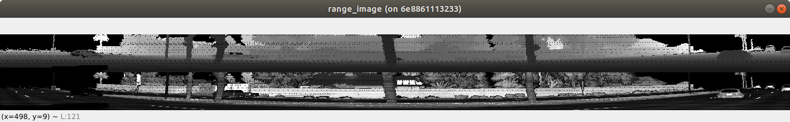
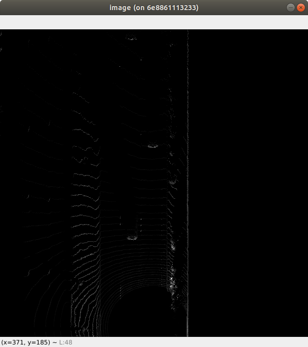
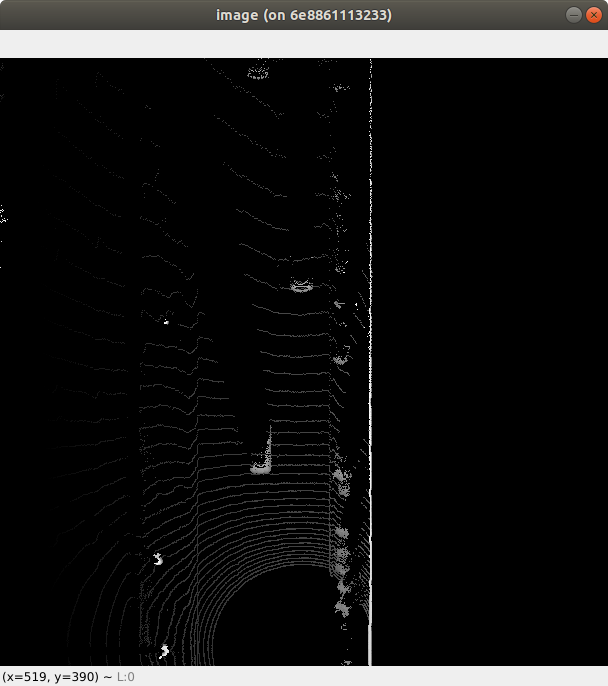
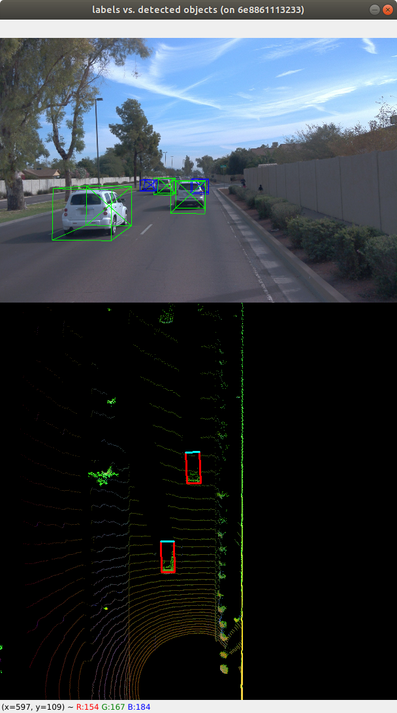
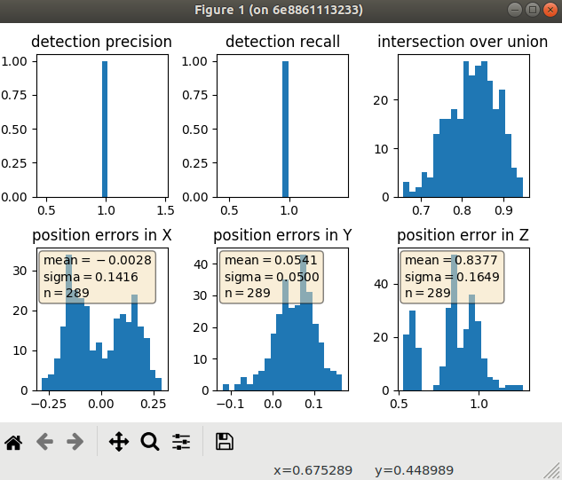
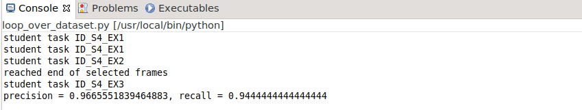
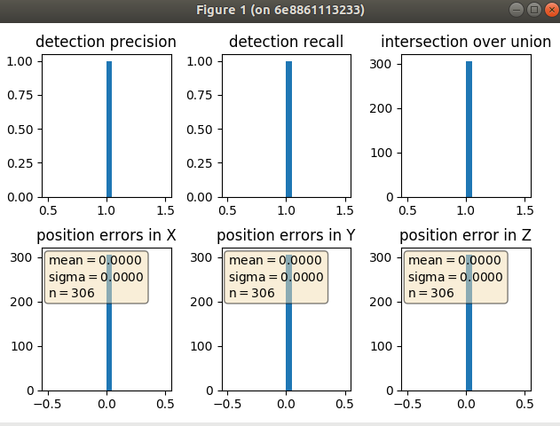

# SDCND : Midterm: 3D Object Detection


In this project, we will be using real-world data from the Waymo Open Dataset, detect objects in 3D point clouds, and evaluate detections results against ground truth. The major project pipeline is as follows:

1. Visualize lidar range image, to get a feel of what kind of information is provided in lidar sensor  
2. Visualize lidar point clound and analyze target object point cloud properties, to get a feel of what kind of information is provided in lidar sensor  
3. Create Bird Eye View from point cloud  
4. Perform deep learning based detection on BEV map  
5. Detection result evaluation  


## Compute Lidar Point-Cloud from Range Image

### Range image visualization

The output range image is a two dimensional array. Its row is pitch, and its column is yaw, and it has two channels, range and intensity. The invovled steps are,  

* extract raw lidar image data from dataset frame  
* extract intensity channel, remove outlier, and scale it to 8 bit image  
* extract range channel, and scale it to 8 bit image  
* stack the the two channels vertically  
* crop the yaw dimension to +- 90 degree, left and right of the forward facing x axis  





### Point cloud visualization

With simple coordinate frame transformation, we can obtain lidar point cloud from range image. The visibitliy of vehicles in point clund are varying, and the consistent features are rear bumper, tail-lights, below are a few typical examples.


## Create Birds-Eye View from Lidar PCL

We will perfrom object detection on BEV map, so we need to obtain it first.

### Vehicle and BEV map frame transformation

Converting vehicle frame to BEV frame is straightforward.   
* vehicle frame is forward(x), left(y), and up(z), while BEV map frame is left(x), forward(y), and up(z)  
* the two frame's scale is different too. vehicle frame's bourndary  is the bounding box detection range limit, and BEV map's boundary is the image size, both are set in configurations  
* for the origin of the frames, BEV's origin is at the bottom right of vehicle frame boundary.  

Vehicle frame point cloud are discretized into BEV space, and then the topmost z coordinate point will extracted out of identical x,y points in BEV space.

### Intensity layer

Intensity layer is normalized by the difference between max and min values before being stacked into BEV image.  

The intesity layer looks like below,  


  

### Height layer
Height layer is normalized by detecton bounding box range limit in z direction.

The height layer looks like below,  




### Density layer

The number of lidar points on each discretized BEV point is added as the density layer of the BEV image.


## Model-based Object Detection in BEV Image
### SFA3D model detection

A pretrained model "Super Fast and Accurate 3D Object Detection based on 3D LiDAR Point Clouds" is used to perform inference on the BEV image generated above. 

### 3D bounding boxes extraction from model output

Among the model output, x, y, w,l are in BEV space, and needs to converted to vehicle space. At the end,  bounding box format [class-id, x, y, z, h, w, l, yaw] is extracted out of model detection results.


object detection result visualization is as below,




## Performance Evaluation for Object Detection

In this step, common evaluation metrics in object detection are implemented to evaluate detection results.

### IOU

For each correctly detected label, we computes the IOU score between label and detections. The main steps are,

* For all pairs of lable and detection, calcuate IOU
* Assign detection to a label only its IOU is above certain threshold
* If a label has multiple eligible detections, pick the one with highest IOU score
* If a label has an eligible detection, increase the true positive by one


### Fasle positive, false negatives, true positives

For one single frame detections, the calcuation for above metrics are as below,  

```
## step 1 : compute the total number of positives present in the scene
all_positives = labels_valid.sum()

## step 2 : compute the number of false negatives
false_negatives = all_positives - true_positives

## step 3 : compute the number of false positives
false_positives = len(detections) - true_positives
```

### Precision and recall

For mulitple frame detection, the precision and recall metric calcuation is as below,

```
## step 1 : extract the total number of positives, true positives, false negatives and false positives
all_positives, true_positives, false_negatives, false_positives = np.array(pos_negs).sum(axis = 0)

## step 2 : compute precision
precision =  true_positives / float(true_positives + false_positives)

## step 3 : compute recall 
recall = true_positives / float(true_positives + false_negatives)
```

Detection performance evaluation visualization is as below,





Just to validate that evaluation codes are properly implemented, below is the evaluation result when we use label as detection result. In this case, we get perfect result as expected.




## Relfection

Converting lidar point to BEV image and perform object detection is certainly an interesing and promising direction. On the other side, lidar sensor is , by its nature, lacked of semantic information. Maybe one altenative is to use both lidar and camera image as neural network input ,and perfrom object detection.

