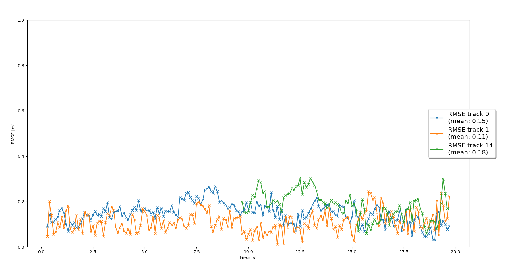
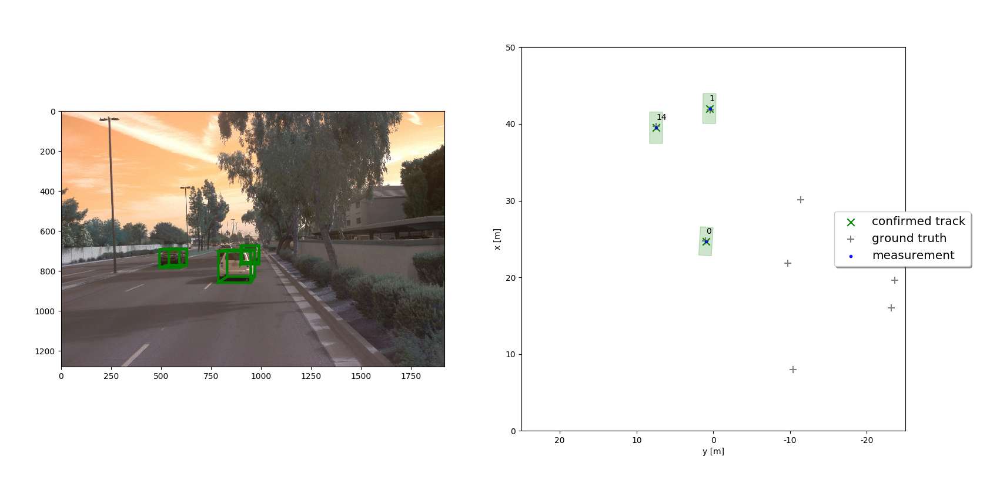
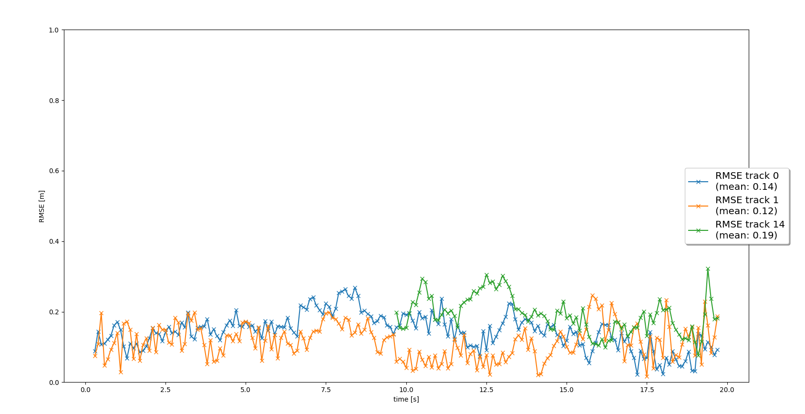
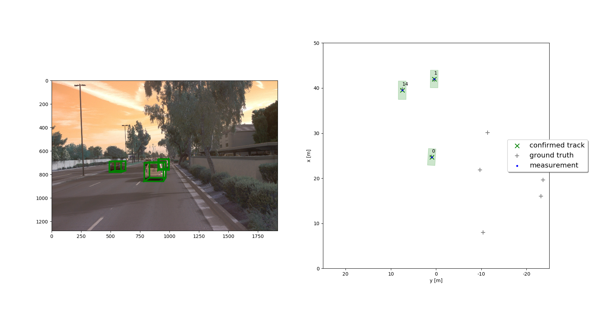

# SDCND : Sensor Fusion and Tracking

In this project, we fuse measurements from LiDAR and camera and track multiple vehicles over time. We will be using real-world data from the Waymo Open Dataset, load precomputed detection result and apply an extended Kalman filter for sensor fusion and tracking.

To run the project, simply run the script `loop_over_dataset.py`. Tracking result will be visualized and corresponding video will be recorded as well.

## Overview

This writeup documents the major workflow of implementing this project, including

* EKF, implement a kalman filter to track a object
* Track management, initialize, update and delete tracks to manage tracking for multiple objects
* Data association,  associate multiple measurements to multiple tracks
* Camera sensor fusion, on the basis of lidar fusion, add camera measurement fusion
* Evaluate, evaluate tracking result against groud truth
* Reflection, address a few  interesting topics raised in SDCND classroom

## EKF
We use ekf to track objects. EKF is implemented in `filter.py`.   

Implementing an ekf includes below work, 

* Design system sate [x,y,z,vx,vy,vz] 
* Design process model, consant velocity model
* implement predict step, with constant velociy model and process noise increasing with delta time
* implement upate step,  with lidar measurement model

For the road segment specified in classroom, the rmse score is 0.28.   

## Track Management

Track management is implemented in `trackmanagement.py`.  
In our system design, One object is represented as a track, and a track list is used to manage multiple objects. To perform prediction and udpate operatin on a track, we pass the track object and measurment info to the EKF.   

Below are the key points of track management:

* Track is initialized after receiving an unassigned lidar measurement.
* A track contains scores. Its score will be increased if it's associated with a measurement, and decreased otherwise.
* A track contains state, which will be updated based on its score.
* A track will be deleted if its score is below a certain treshold and its state convariance is largher than a threshold.

On the road segment specified in classroom, we can see a vehicle appear and then disapper, accordingly, we can see the track is initialized, confirmed, and then deleted.

## Data Association

In this step, multiple measurements are properly matched to multiple tracks via nearest neighbor association. Data association is implemented in `association.py`.  

Below are the key steps invovled in data association,  

1) Create a mtraix for all available tracks and obervations.  
2) Calculate Mahalanobis distance (MHD) for each track measurement pairs.  
3) Use Chi Square hypotheisis test to reject unlikely track measurement pairs.  
4) Pick out the pair with smallest MHD, perform ekf update step, and then remove corresponding row and column in the association matrix.  
5) Go back to step 4 until all valid pairs are processed.  

Aftrer implementing the above, we can see from the video in the Sensor Fusion section that multiple measurements are propelry associated with multiple tracks.  

## Camera Sensor Fusion

In the step, we add camera measurements to the ekf fusion.  One key assumption used in this step is that the center of 3d bounding box in space for a vehicle correponds to the center of 2d bounding box of the vehicle in image. In reality, this assumption is roughly true, but may not necessarily be precise for a front camera.

Implementing camera measurement fusion consists of below major aspects,

* measurment model, the projection matrix which transforms points from 3d in space to 2d in image.
* Jocobian for the measurement model, the partial derivative of system state(x,y,z) with respect to measurement(u, v)
* measurement noise R for camera measurement
* check if a track's state is within camera's field of view to reject incorrect measurement-track pair

Under project directory, there is a recorded video **my_tracking_results.avi** for vehicle tracking via fusing both lidar and camera measurements.

From the video, we can see that the tracking performs well, and there is no ghost track or track loss.

## Evaluation

Tracking performance is evaluated using RMSE metric. and below is the result for lidar and camera fusion.

RMSE chart:

Tracking chart:

Just for an interesting comparison, below is the result for lidar only fusion, we will expand on the impact of adding camera fusion in the Reflection section.

RMSE chart:

Tracking chart:

## Reflection

In this section, we address a few topics raised in the classroom.

### Most difficult part

Overall I think the completion of this project is quite straightforward, as the implementation of ekf, track management, and data assocation, camera/lidar fusion are well guided in lectures. The overall framework of this project is also excellently organized, which makes it easy to complete the project step by step.

One thing I find difficult for a while is the camera measurment model implementation, projecting 3d points to 2d points. Waymo's camera coordinate frame deviates from the z-froward, x-right, and y down coordinate frame I usually use in my work, so there is a tricky job of cameara axis transformation. Then it dawned on me that the visualization part of this project's starter codes already implement this logic, hence relvant code implementations are located and  understood, and the problem gets resolved.

### The impact of adding camera fusion

In theory, adding camera fusion should increase the robustness and accuracy of the trackig system.

But the camera measurement model used in this project is not exactly correct. It tries projecting the centroid of 3d bounding box in space to the center of bounding box in image, in reality this assumption does not hold true.

As expected, in our experiment, we don't really see obvious improvement after adding camera measurement fusion.

### Challenges in real-life sensfor fusion and tracking project

This project allows us to handle some typical challengs in real-life sensor fusion and tracking algorithm, including  

* accurate association between mulitple tracks and multiple measurement. sometimes it's quite difficult to set a good gating thresholds (rejecting incorrect measurment and track pair) for all scenarioes.  
* measurement noise configuration. In fact, it's better that each measurement should come with its own noise variance, as opposed to setting a fixed noise variance for a sensor  
* choice of process model. Constant Velocity model, Constarnt Turn Rate and Velocity, Contstant Turn Rate and Acceleration model,and ete are all valid options, we need to strike a balance between computations and accuracy. 

One common challenge in real-life project that this project does not experience is extrinsic parameters calibration.  A correct configuration for lidar and camera extrinsic parameter is vital to the success of a sensor fusion and tracking project. In this project, these extrinsic parameters are known as we are using a public dataset.

### Improvement opportunity

As stated above, current camera measurement model is quite rough, causing the benifit of adding camera fusion trivial.  As  an alternative, we can match the actual 3d points in lidar point cloud to vehicle object pixels in image, a theorectially sound camera measurement model should help with the fusion result.

